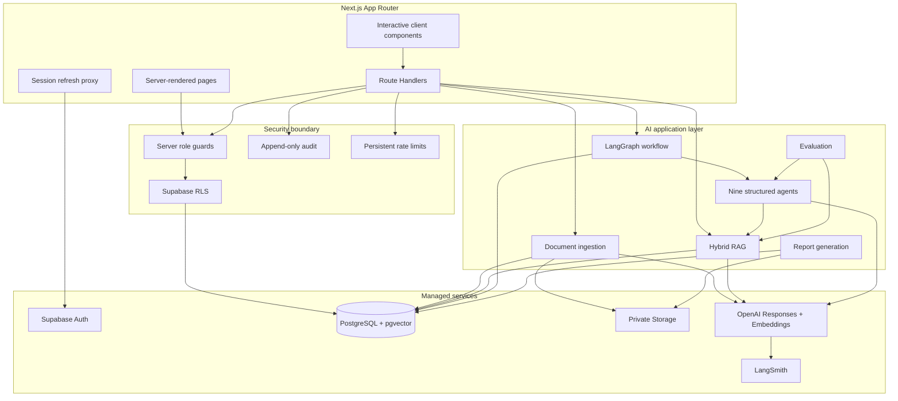

# Architecture relationship diagram

The diagram is intentionally directional: UI modules call server boundaries, AI modules do not import UI, and every durable state transition ends in PostgreSQL.
