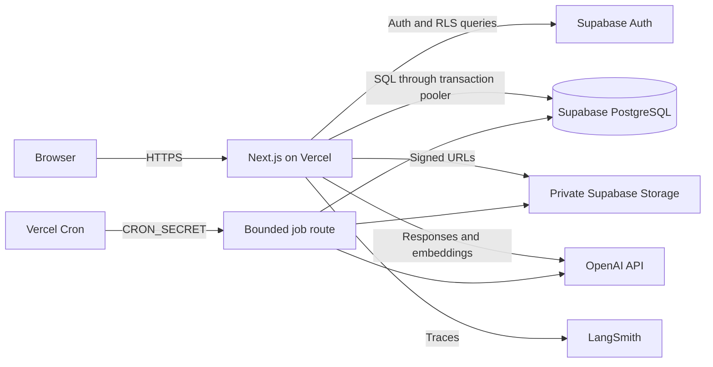
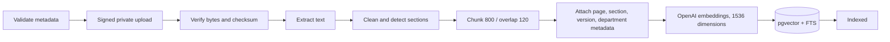
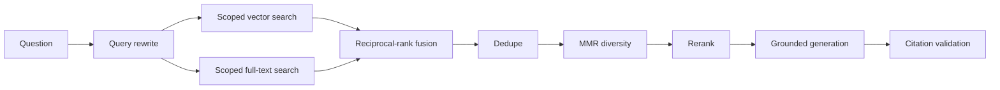

# PolicyPulse AI architecture

PolicyPulse AI is a single Next.js App Router application deployed to Vercel. Supabase is the managed identity, PostgreSQL, pgvector, and private object-storage provider. There is no separately deployed API or worker.

## Runtime boundaries

The browser receives only the Supabase URL and publishable key. OpenAI, Supabase secret, database, LangSmith, and cron credentials remain server-side.

## Durable work model

Completed uploads queue ingestion; comparison workflows and evaluation runs also create rows in `background_jobs`. Through the Supabase transaction-pooler `DATABASE_URL`, a Vercel invocation claims one job with a 90-second renewable lease and records heartbeat/completion/failure transitions. It executes one bounded idempotent step, writes artifacts and LangGraph checkpoints, and either completes or schedules the next job. Document extraction stages unembedded chunks; 32-chunk embedding jobs advance by persisted generation/index until the document becomes Indexed. Final workflow materialization prebuilds versioned Markdown and private PDF reports. PostgreSQL is authoritative; module memory is only an optional cache.

This design survives page refreshes, function restarts, OpenAI failures, duplicate delivery, and delayed human approval. Stable idempotency keys and unique database constraints make retries safe.

## Module boundaries

- `app`: routes, layouts, server actions, and Route Handlers.
- `components`: reusable product UI and small client-only interaction islands.
- `lib/auth`: session and permission checks.
- `lib/supabase` and `lib/db`: managed-service access.
- `lib/documents`: validation, extraction, cleaning, section detection, and token-aware chunking.
- `lib/rag`: query rewriting, scoped vector/FTS search, reciprocal-rank fusion, MMR, reranking, and citation validation.
- `lib/openai`: tracked OpenAI calls, structured output, retries, cost, and latency accounting.
- `lib/ai`: versioned agent definitions, schemas, tools, and prompts.
- `lib/workflows`: LangGraph state, nodes, routing, interrupts, and durable checkpoints.
- `lib/evaluation`: three-mode evaluation and metrics.
- `lib/reports`: on-screen, Markdown, PDF, and print outputs.
- `supabase`: migrations, RLS, storage policies, RPCs, and seed data.

Client modules never import privileged service modules. Route Handlers repeat authorization even when a page has already hidden an action, and RLS remains the last boundary.

## Document ingestion

Documents are untrusted input. Extracted content is delimited as evidence, never concatenated as system instructions, and suspicious injection signals are retained for audit without granting them authority.

## Hybrid RAG

Organization, department, document, and version filters are applied in retrieval, not after generation. If evidence is inadequate, the exact fallback is: “I could not find sufficient evidence in the uploaded policies.”

## Deployment constraints

- Node.js runtime for PDF/DOCX parsing, LangGraph, PostgreSQL, and PDF generation.
- Direct signed uploads avoid Vercel request-body and duration limits.
- `/tmp` may be used only for disposable bounded scratch work; it is never authoritative.
- The Supabase transaction pooler is used with small pools and prepared statements disabled.
- Chat streams from a Route Handler after retrieval is complete.
- Finished documents and reports are private Supabase Storage objects.
