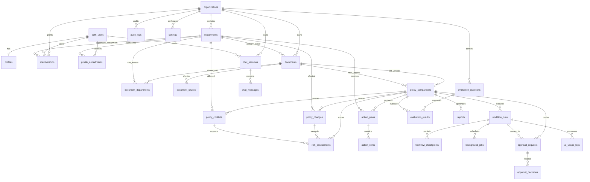

# Database design

PolicyPulse uses one Supabase PostgreSQL database with organization-scoped rows. `memberships` is the authoritative role source; JWT metadata is never used to authorize a request. Repeated `organization_id` columns and composite foreign keys make cross-tenant references invalid even when code is defective.

## Retrieval storage

`document_chunks.embedding` is `extensions.vector(1536)`, matching `text-embedding-3-small`. Each chunk also has a stored weighted `tsvector`: section headings carry weight A and content carries weight B. An HNSW cosine index supports semantic candidates and a GIN index supports lexical candidates. `hybrid_search_document_chunks` applies organization, document, department, and version filters before reciprocal-rank fusion, then returns citation-ready document title, version, page, section, snippet content, and storage path.

Chunk metadata is intentionally denormalized from its document so retrieval does not need many joins. Triggers copy and synchronize the organization, primary department, version, category, effective date, and storage path. The composite document foreign key remains the source-of-truth tenant guard.

## Durable workflows

`workflow_runs.thread_id` is unique per organization. `workflow_checkpoints` stores application state plus LangGraph-compatible `channel_values`, `channel_versions`, `versions_seen`, and `pending_sends`. `save_workflow_checkpoint` locks the run, idempotently persists the checkpoint, and advances the run pointer in one transaction.

`background_jobs` is a durable queue. `claim_background_jobs` uses `FOR UPDATE SKIP LOCKED`, increments attempts, and issues an expiring worker lease. Expired leases return to the retry queue unless attempts are exhausted. Heartbeat, completion, and failure RPCs require the matching worker UUID, which prevents a stale function invocation from completing another worker's lease.

## Evidence and history

Findings retain both text and structured citation JSON. Approval decisions are append-only and record the previous and new status plus analysis version. Audit and AI usage logs use identity keys and are never client-updatable. Reports may be held inline or in the same private Storage bucket; secrets are prohibited in `settings` and remain in Vercel environment variables.

## File map

- `202608250001_extensions_and_types.sql`: extensions and constrained enums
- `202608250002_schema.sql`: tables, foreign keys, checks, vector/FTS and operational indexes
- `202608250003_security_helpers_and_triggers.sql`: authorization helpers, invariants, audit/rate-limit and state triggers
- `202608250004_application_rpcs.sql`: transactional upload, queue, checkpoint, approval, and hybrid retrieval RPCs
- `202608250005_row_level_security.sql`: grants and organization/department RLS policies
- `202608250006_private_storage.sql`: private bucket and object authorization
- `supabase/seed.sql`: idempotent Northbridge College demo metadata and evaluation ground truth

