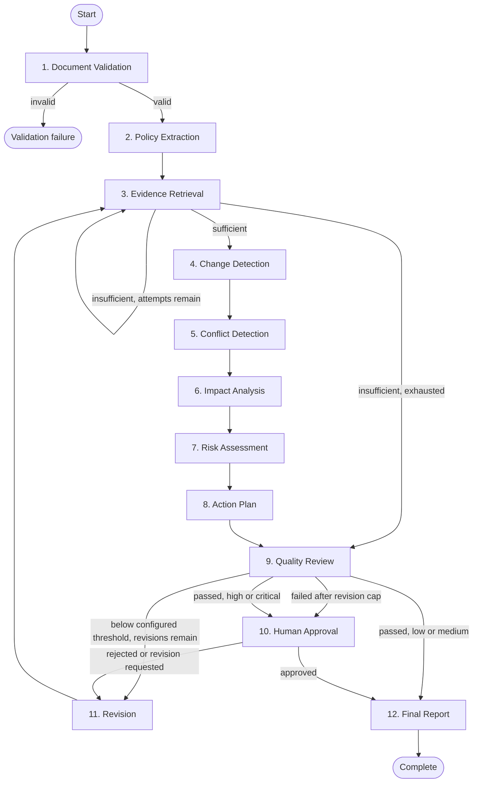

# LangGraph workflow

The graph uses a JSON-serializable state. Each checkpoint holds the full resumable workflow snapshot—including selected citations and structured artifacts—while normalized tables expose current findings, plans, approvals, and reports for efficient UI/RLS queries. Revisions replace those current projections; earlier snapshots and versioned reports retain the audit history.

## Human interrupt and resume

The Human Approval node idempotently materializes one pending `approval_requests` row, then LangGraph persists the interrupt. The bounded worker also verifies that the pending request exists after detecting the pause. The transactional decision RPC appends the sole `approval_decisions` row, protects the expected analysis version, resolves the request, and queues the same `thread_id` for a validated resume command. Re-entering the interrupt node never reopens the resolved request. Revision requests create a new analysis version; earlier checkpoints and approval history remain immutable.

## Retry policy

Transient network and 429/5xx responses use bounded exponential backoff with jitter and persist the next attempt time. Schema failures consume the agent retry budget. Invalid documents and authorization failures are permanent. The quality threshold and automatic-revision cap come from validated organization settings (defaults 0.80 and two). After that cap or exhausted evidence recovery, the workflow requests human review instead of silently degrading.

## Public reasoning trace

Private chain-of-thought is never stored or shown. The activity feed contains only tool name, evidence summary, confidence, concise decision, and final conclusion.
